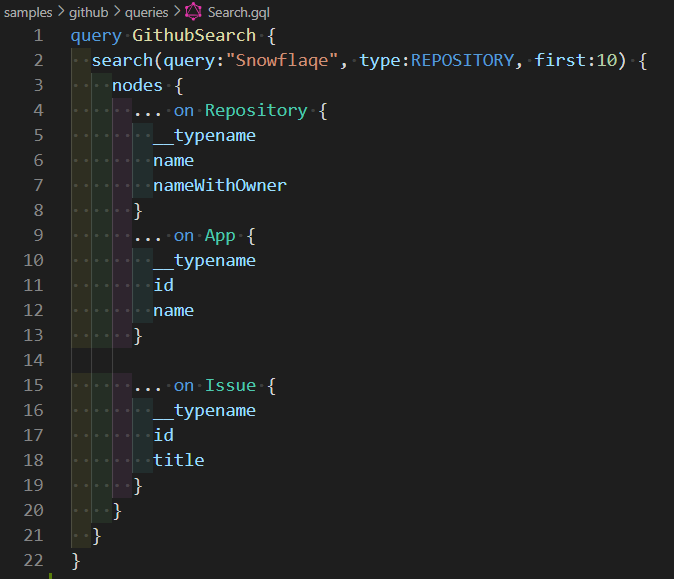
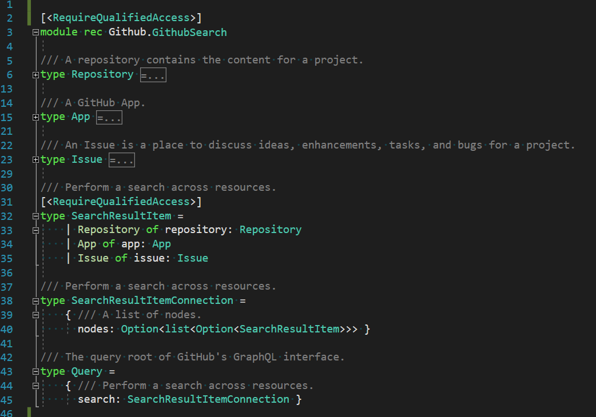

# Snowflaqe [](https://ci.appveyor.com/project/Zaid-Ajaj/snowflaqe) [](https://www.nuget.org/packages/Snowflaqe)

A dotnet CLI tool for generating type-safe GraphQL clients for F#.

### Features
 - Static query *analysis*, *verification* and *type checking* against a remote or local GraphQL schema.
 - Generating idiomatic F# types from GraphQL queries
 - Generating type-safe [Fable](https://fable.io/) or F# GraphQL client project in a single command. This project can be then referenced by your application and will be ready to go.
 - Supports GraphQL interfaces and unions
 - Resolves type name collisions when re-using types in a single query
 - Generates a HTTP client with functions that correspond to the query or mutation names. These functions handle exact JSON deserialization for the returned data.
 - Tested with different GraphQL backends generated from [graphql-dotnet](https://github.com/graphql-dotnet/graphql-dotnet), [hasura](https://hasura.io/), [postgraphile](https://www.graphile.org/postgraphile/) and [absinthe](https://github.com/absinthe-graphql/absinthe).

## Installation
Install as a global dotnet CLI tool
```
dotnet tool install snowflaqe -g
```
## Using The Tool
Create a JSON file called `snowflaqe.json` with the following shape:
```
{
    "schema": "<schema>",
    "queries": "<queries>",
    "project": "<project>",
    "output": "<output>"
    ["target"]: "<target>",
    ["errorType"]: <custom error type>,
    ["overrideClientName"]: "<clientName>",
    ["copyLocalLockFileAssemblies"]: <true | false>,
    ["emitMetadata"]: <true | false>,
    ["createProjectFile"]: <true | false>,
    ["normalizeEnumCases"]: <true | false>,
    ["asyncReturnType"]: <"async" | "task">
    ["serializer"]: <"newtonsoft" | "system">
}
```
Where
 - `<schema>` can be one of:
   - A URL to the GraphQL backend
   - A relative path to another JSON file containing the output of the [standard Introspection](https://github.com/Zaid-Ajaj/Snowflaqe/blob/master/src/Introspection.gql) query which you can execute against the backend yourself (this allows for offline verification and type-checking)
   - A relative path to a file with extension `.gql` or `.graphql` containing the schema definitions and types
 - `<queries>` is an absolute or relative path to a directory that contains `*.gql` files that contain individual GraphQL queries that `snowflaqe` will run the verification against.
 - `<project>` is the name of the project will be generated.
 - `<output>` is an absolute or relative path to a directory where the project will be generated. It is recommended to use an empty directory relative to configuration file because each time you generate and regenarate the project, this directory is cleaned.
 - `<errorType>` optional custom error type to be generated. See below to learn more.
 - `<clientName>` optional name for the `GraphqlClient` class which is `{project}GraphqlClient` by default when you don't provide this property.
 - `<copyLocalLockFileAssemblies>` Adds the attribute to the generated F# project for scenarios where embedding the dependencies is required
 - `<emitMetadata>` when set to `true`, emits code generation metadata as comments into the output modules. The option is set to `false` by default.
 - `<normalizeEnumCases>` determines whether enum case names should be normalized (true by default when omitted)
 - `createProjectFile` determines whether snowflaqe should output a `.fsproj` file when set to `true` (default value) or output a `.props` file instead when set to `false`
 - `asyncReturnType` when targetting F# on dotnet, determines the output type of the client functions, whether they return `Async<'T>` when this option is set to "async" or return `Task<'T>` when set to "task". This option is not compatible for Fable projects since Fable doesn't support tasks.
 - `serializer`: for `fsharp` targets, determines whether to use Newtonsoft.Json (default) as the JSON serializer or System.Text.Json when set to "system".
 - `<target>` optional the code-generation target which can either be `fable` (default), `fsharp` or `shared`.

> Using `shared` as a code generation target actually builds 3 projects! One contains just the types and can be *shared* across platforms. The other two reference this shared projects and implement Fable specific client and dotnet specific client, respectively.

After creating the configuration file. You can `cd` your way to where you have the config file and run:
```
snowflaqe
```
which will by default only do static query verification and static type-checking against the `<schema>`. You can also *reference* the configuration file in another directory via a relative path:
```
snowflaqe --config ./src/snowflaqe.json
```
> In this case, the file doesn't necessarily have to be called `snowflaqe.json`.

## Generate Client Project
```
snowflaqe --generate

snowflaqe --config ./path/to/snowflaqe.json --generate
```
Will generate a full project in the designated `output` directory. You can start using the generated project by *referencing* it from another project using a reference as follows:
```xml
<ProjectReference Include=".\path\to\generated\Project.fsproj" />
```
You can either do this manually or using an IDE such as Visual Studio or Rider that allow you to `Right Click -> Add Existing Project`.

You don't need to reference extra packages or anything, once you `dotnet restore` the generated project will pull in the packages that it requires.

It is worth mentioning that the generated project will target `netstandard2.0` which means you can use anywhere in .NET Core or even in full .NET Framework v4.7.1+

### Screenshots

Here are screenshots of how such generated project looks like. In this case, we have a project generated from the Github GraphQL API (Fable target):

Given the query



The corresponding query types are generated



All queries and mutations can be called from a dedicated `GraphqlClient`


## Custom Error Type

By default, the error type that is generated in the global types looks like this:
```fs
type ErrorType = { message: string }
```
This type is important because every request you make to the GraphQL backend returns `Result<Query, ErrorType list>` but the errors that come back are usually determined by the backend and not exposed through the schema. That is why you can customize this error type using the `errorType` configuration element:
```
{
    "schema": "<schema>",
    "queries: "<queries>",
    "project": "<project>",
    "output": "<output>",
    "errorType": {
        "CustomErrorType": {
            "Message": "string"
            "Path": "string list"
            "RequestId": "string"
        }
    }
}
```
which will generate:
```fs
type CustomErrorType = {
    Message: string
    Path: string list
    RequestId: string
}
```
## Not Supported

There are a couple of features of the GraphQL specs which `snowflaqe` doesn't (yet) know how to work with:
 - [ ] Subscriptions
